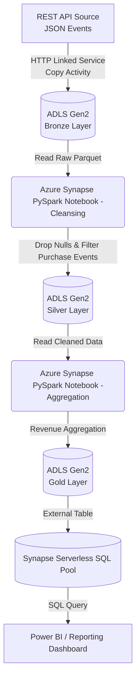

# End-to-End Azure Data Engineering Project: Retail Transaction Analytics

<div align="center">


A fully automated **Azure Data Engineering Pipeline** implementing the **Medallion Architecture** using **Azure Synapse Analytics, ADLS Gen2, PySpark, and Serverless SQL Pool** for retail transaction analytics.

</div>

---

# 📑 Table of Contents

* [📌 Project Overview](#-project-overview)
* [🛠️ Tech Stack](#️-tech-stack)
* [📋 Project Plan](#-project-plan)
* [📊 Business Requirements](#-business-requirements)
* [🏗️ Data Architecture](#️-data-architecture)
* [⚙️ Architecture Decisions](#️-architecture-decisions)
* [🥉🥈🥇 Medallion Architecture](#-medallion-architecture)
* [📐 Architecture Diagram](#-architecture-diagram)
* [🚀 Project Initialization](#-project-initialization)
* [🔄 ETL/ELT Workflow](#-etlelt-workflow)
* [💻 Code Implementation](#-code-implementation)
* [⚠️ Challenges & Solutions](#️-challenges--solutions)
* [▶️ How to Run the Project](#️-how-to-run-the-project)
* [📌 Detailed Setup](#-detailed-setup)
* [📈 Future Enhancements](#-future-enhancements)

---
# 📌 Project Overview

## Problem Statement

A retail client captures continuous e-commerce transaction events such as:

* Purchases
* Refunds
* Cancellations

through a REST API. Currently, the raw JSON data is not optimized for analytics and business intelligence reporting.
## Objective

Design and implement a scalable and automated Azure-based data pipeline that:

* Extracts raw API data
* Cleans and transforms data
* Aggregates business metrics
* Serves analytics-ready datasets

using the **Medallion Architecture**.

## Real-World Use Case

The business stakeholders require an automated daily report to answer two specific questions: 
* What is the total number of purchases daily? 
* What is the total daily revenue?

---

# 🛠️ Tech Stack

| Technology                   | Purpose                      |
| ---------------------------- | ---------------------------- |
| Azure Synapse Analytics      | Unified analytics workspace  |
| Azure Data Lake Storage Gen2 | Data Lake storage            |
| Synapse Pipelines            | Data orchestration           |
| Apache Spark (PySpark)       | Distributed data processing  |
| Serverless SQL Pool          | Analytics querying           |
| Parquet                      | Optimized analytical storage |
| Power BI                     | Reporting & dashboarding     |


Datasets:
A simulated e-commerce REST API endpoint outputting raw JSON events (Event ID, Event Type, Customer ID, Timestamp, Payment Method, Amount, Product ID).

---

# 📋 Project Plan

## Project Management 

### Epic: Retail Sales Analytics Pipeline Setup

### Kanban Workflow

```text
Backlog → To Do → In Progress → Review → Done
```

## Tasks Breakdown

| Task   | Description                  |
| ------ | ---------------------------- |
| Task 1 | Environment Setup (Provision Synapse Workspace, ADLS Gen2, and configure security).           |
| Task 2 | Ingestion Pipeline Setup (API to Bronze ADLS via Synapse Pipeline Copy Activity).       |
| Task 3 | Data Transformation (PySpark notebooks for Silver layer cleansing).  |
| Task 4 | Data Aggregation (PySpark notebooks for Gold layer metrics).       |
| Task 5 | Serving Layer (Serverless SQL External Tables). |

---

# 📊 Business Requirements

## Functional Requirements

* Ingest JSON payloads continuously from the source REST API.
* Filter the dataset to include only "purchase" events, discarding refunds and cancellations.
* Clean the data by dropping records with null customer_id or amount values.
* Calculate daily aggregate metrics (Sum of Amount = Total Revenue, Count of Events = Total Purchases).
* Expose the final metrics via standard SQL for Business Intelligence tools.

## Non-Functional Requirements

### Performance

* Fast big data processing leveraging distributed in-memory compute.

### Cost Optimization

* Utilize pay-as-you-go serverless models to avoid provisioning expensive, always-on DWH clusters.

## Assumptions

* API schema remains consistent
* Data volume justifies Spark-based processing

---

# 🏗️ Data Architecture

## High-Level Architecture

### Source Layer

* Mock REST API serving JSON transaction events

### Ingestion Layer

* Synapse Pipeline Copy Activity

### Storage Layer

* ADLS Gen2 using Bronze/Silver/Gold structure

### Processing Layer

* PySpark notebooks in Synapse Spark Pool

### Consumption Layer

* Serverless SQL Pool + Power BI

---

# ⚙️ Architecture Decisions

## Why Azure Synapse Analytics?

Instead of managing separate services such as:

* Azure Data Factory
* Azure Databricks
* Azure SQL Database

Azure Synapse provides:

✅ Unified workspace
✅ Integrated orchestration
✅ Spark processing
✅ SQL analytics
✅ Simplified governance

---

## Why Serverless SQL Pool?

| Dedicated SQL Pool          | Serverless SQL Pool |
| --------------------------- | ------------------- |
| Pay per provisioned compute | Pay per query       |
| Always running              | On-demand           |
| Higher operational cost     | Cost efficient      |

Serverless SQL was selected because reporting queries are executed only when needed.

---

## Why Parquet?

Compared to CSV/JSON:

✅ Columnar storage
✅ Faster analytical queries
✅ Better compression
✅ Reduced storage costs

---

# 🥉🥈🥇 Medallion Architecture

## 🥉 Bronze Layer — Raw Data

Stores immutable raw API data exactly as received.

### Purpose

* Historical backup
* Source of truth
* Auditability

---

## 🥈 Silver Layer — Cleansed Data

Performs:

* Purchase event filtering
* Null handling
* Data type casting
* Standardization

---

## 🥇 Gold Layer — Business Aggregates

Contains analytics-ready metrics:

* Total revenue
* Total purchases
* Daily KPIs

---

# 📐 Architecture Diagram

```mermaid
flowchart LR

%% =====================================================
%% 1. DATA SOURCES
%% =====================================================

subgraph Sources["1️⃣ Data Sources"]
    direction TB

    API["🌐 Mock Retail REST API<br/>GitHub JSON"]:::source
    ExtFiles["📄 External Files<br/>CSV & JSON"]:::source
end

%% =====================================================
%% 2. INGESTION & INTEGRATION
%% =====================================================

subgraph Integration["2️⃣ Synapse Pipelines Integration"]
    direction TB

    Copy1["🔄 Copy Data Activity<br/>API → Lake"]:::pipeline
    Copy2["🔄 Copy Data Activity<br/>CSV → JSON"]:::pipeline
end

%% =====================================================
%% 3. STORAGE LAYER
%% =====================================================

subgraph Storage["3️⃣ Azure Data Lake Storage Gen2"]
    direction TB

    subgraph Medallion["Retail Medallion Architecture"]

        Bronze["🥉 Bronze Layer<br/>Raw Parquet"]:::bronze

        Silver["🥈 Silver Layer<br/>Cleansed Parquet"]:::silver

        Gold["🥇 Gold Layer<br/>Aggregated Parquet"]:::gold

    end

    InputOut["📦 Input / Output Containers<br/>Ad-hoc Files"]:::lake
end

%% =====================================================
%% 4. COMPUTE LAYER
%% =====================================================

subgraph Compute["4️⃣ Synapse Compute Engines"]
    direction TB

    Spark1["⚡ Apache Spark Pool<br/>Bronze → Silver"]:::spark

    Spark2["⚡ Apache Spark Pool<br/>Silver → Gold"]:::spark

    ServerlessQuery["🗄️ Serverless SQL Pool<br/>OPENROWSET Queries"]:::sql

    DedicatedQuery["🏢 Dedicated SQL Pool<br/>MPP Compute"]:::sql
end

%% =====================================================
%% 5. SERVING LAYER
%% =====================================================

subgraph Serving["5️⃣ Serving & Data Warehouse"]
    direction TB

    DB_Retail["📊 retail_pc Database<br/>daily_revenue Table"]:::serve

    DB_Testing["📋 testing Database<br/>employee Table"]:::serve
end

%% =====================================================
%% 6. CONSUMPTION LAYER
%% =====================================================

subgraph Consumption["6️⃣ Consumption Layer"]

    PBI["📈 Power BI / Stakeholder Reports"]:::bi

end

%% =====================================================
%% MAIN RETAIL PROJECT FLOW
%% =====================================================

API -- "HTTP Linked Service" --> Copy1

Copy1 -- "JSON → Parquet" --> Bronze

Bronze -- "Read Raw Data" --> Spark1

Spark1 -- "Cleanse & Filter Purchases" --> Silver

Silver -- "Read Clean Data" --> Spark2

Spark2 -- "Aggregate Revenue Metrics" --> Gold

Gold -- "External Table Mapping" --> DB_Retail

DB_Retail -- "T-SQL Queries" --> PBI

%% =====================================================
%% MINI PRACTICAL FLOW
%% =====================================================

ExtFiles -- "Linked Service" --> Copy2

Copy2 -- "Format Conversion" --> InputOut

InputOut -- "Ad-hoc File Querying" --> ServerlessQuery

ServerlessQuery -- "Query Results" --> PBI

InputOut -- "Load Data" --> DedicatedQuery

DedicatedQuery -- "Create External Table" --> DB_Testing

%% =====================================================
%% STYLING
%% =====================================================

classDef source fill:#f5f5f5,stroke:#424242,stroke-width:2px,color:#000;
classDef pipeline fill:#e3f2fd,stroke:#1e88e5,stroke-width:2px,color:#000;
classDef lake fill:#e0f7fa,stroke:#00838f,stroke-width:2px,color:#000;

classDef bronze fill:#d7ccc8,stroke:#6d4c41,stroke-width:2px,color:#000;
classDef silver fill:#cfd8dc,stroke:#546e7a,stroke-width:2px,color:#000;
classDef gold fill:#fff8e1,stroke:#ffb300,stroke-width:2px,color:#000;

classDef spark fill:#fff3e0,stroke:#ef6c00,stroke-width:2px,color:#000;

classDef sql fill:#ede7f6,stroke:#5e35b1,stroke-width:2px,color:#000;

classDef serve fill:#fce4ec,stroke:#d81b60,stroke-width:2px,color:#000;

classDef bi fill:#fffde7,stroke:#f9a825,stroke-width:2px,color:#000;
```





---

# 🚀 Project Initialization

## Azure Resources Created

| Resource          | Name                |
| ----------------- | ------------------- |
| Resource Group    | `PC_Resource_Group` |
| Storage Account   | `pcretail`          |
| Synapse Workspace | `PC-synapse-retail` |
| Spark Pool        | `PCSpark`           |

---

## ADLS Folder Structure

```text
retail/
│
├── bronze/
├── silver/
└── gold/
```

---

# 🔄 ETL/ELT Workflow

## 1️⃣ Extract

* Synapse Pipeline triggers daily
* REST API accessed through HTTP Linked Service

---

## 2️⃣ Load

* Raw JSON converted into Parquet
* Stored in Bronze layer

```text
abfss://retail@pcretail.dfs.core.windows.net/bronze
```

---

## 3️⃣ Transform

### Silver Notebook

* Filters purchase events
* Removes nulls
* Casts data types

### Gold Notebook

* Aggregates revenue metrics
* Generates daily KPIs

---

# 💻 Code Implementation

# 🥈 Silver Layer Cleansing (PySpark)

```python
from pyspark.sql.functions import col, to_date, lower

# Read Bronze Data
df_bronze = spark.read.parquet(
    "abfss://retail@pcretail.dfs.core.windows.net/bronze"
)

# Cleansing & Transformation
df_silver = (
    df_bronze
    .filter(col("event_type") == "purchase")
    .dropna(subset=["customer_id", "amount"])
    .withColumn("event_date", to_date(col("event_timestamp")))
    .withColumn("payment_method", lower(col("payment_method")))
    .withColumn("amount", col("amount").cast("float"))
)

# Write Silver Layer
df_silver.write.mode("overwrite").parquet(
    "abfss://retail@pcretail.dfs.core.windows.net/silver"
)
```

---

# 🥇 Gold Layer Aggregation (PySpark)

```python
from pyspark.sql.functions import sum, count

# Read Silver Data
df_silver = spark.read.parquet(
    "abfss://retail@pcretail.dfs.core.windows.net/silver"
)

# Aggregate Metrics
df_gold = df_silver.groupBy("event_date").agg(
    sum("amount").alias("total_revenue"),
    count("*").alias("total_purchase")
)

# Write Gold Layer
df_gold.write.mode("overwrite").parquet(
    "abfss://retail@pcretail.dfs.core.windows.net/gold"
)
```

---

# 🗄️ Serverless SQL Pool (T-SQL)

```sql
-- Create Database
CREATE DATABASE retail_pc;
GO

USE retail_pc;
GO

-- External Table
CREATE EXTERNAL TABLE daily_revenue (
    event_date DATE,
    total_revenue FLOAT,
    total_purchase INT
)
WITH (
    LOCATION = 'gold/',
    DATA_SOURCE = BlobRetailDataSource,
    FILE_FORMAT = ParquetFormat
);
GO

-- Query Data
SELECT TOP 100 * FROM daily_revenue;
```

---

# ⚠️ Challenges & Solutions

| Challenge                                            | Solution                                  |
| ---------------------------------------------------- | ----------------------------------------- |
| Invalid float/double schema mapping during ingestion | Manually mapped schema in Copy Activity   |
| PySpark path reading exceptions                      | Used full `abfss://` absolute path        |
| JSON schema inconsistencies                          | Enforced explicit casting in Silver layer |
| Cost optimization during development                 | Disabled auto-scaling in Spark Pool       |

---

# ▶️ How to Run the Project

## Step 1 — Deploy Azure Resources

Create:

* Azure Synapse Workspace
* ADLS Gen2 Storage Account
* Apache Spark Pool

---

## Step 2 — Clone Repository

```bash
git clone https://github.com/your-username/azure-retail-data-engineering-project.git
```

---

## Step 3 — Configure Linked Services

Create:

* HTTP Linked Service
* ADLS Gen2 Linked Service

using Managed Identity authentication.

---

## Step 4 — Upload Notebooks

Import:

* `bronze_to_silver.ipynb`
* `silver_to_gold.ipynb`

into Synapse Studio.

---

## Step 5 — Execute Pipeline

Pipeline flow:

```text
REST API → Bronze → Silver → Gold
```

Trigger the pipeline manually or schedule daily execution.

---

## Step 6 — Query Results

Execute:

```sql
SELECT * FROM daily_revenue;
```

using Synapse Serverless SQL Pool.

---
# 📌 Detailed Setup

# 🚀 Part 1 — Initial Workspace & Resource Setup

## Step 1 — Create Synapse Workspace

1. Open Azure Portal
2. Search for **Azure Synapse Analytics**
3. Click **Create**

---

## Step 2 — Configure Basics

| Setting        | Value                   |
| -------------- | ----------------------- |
| Subscription   | Your Azure Subscription |
| Resource Group | `PC_Resource_Group`     |
| Workspace Name | `PC synapse practical`  |
| Region         | `East US 2`             |

---

## Step 3 — Configure ADLS Gen2

### Create Storage Account

| Setting              | Value         |
| -------------------- | ------------- |
| Storage Account Name | `P data lake` |
| File System Name     | `P input`     |

---

## Step 4 — Configure Security

Set:

* SQL Administrator Username
* SQL Administrator Password

Click:

```text id="e7zq4f"
Review + Create → Create
```

---

## Step 5 — Open Synapse Studio

After deployment:

```text id="k9x1yb"
Go to Resource Group → Synapse Workspace → Open Synapse Studio
```

---

# 🗄️ Part 2 — Serverless SQL Pool Practical

## Objective

Query CSV and JSON files directly from the Data Lake without provisioning compute infrastructure.

---

# 📄 Querying CSV Files

## Step 1 — Upload CSV File

Inside Synapse Studio:

```text id="e3ahq2"
Data Tab → Linked → ADLS Gen2 → Upload employee1.csv
```

---

## Step 2 — Generate SQL Script

Right-click the uploaded file:

```text id="y7fd1m"
New SQL Script → Select TOP 100 rows
```

---

## Step 3 — Fix CSV Headers

Modify generated `OPENROWSET` query:

```sql id="u2lm9w"
SELECT *
FROM OPENROWSET(
    BULK 'employee1.csv',
    DATA_SOURCE = 'YourDataSource',
    FORMAT = 'CSV',
    PARSER_VERSION = '2.0',
    HEADER_ROW = TRUE
) AS rows
```

---

## Step 4 — Run Aggregation Query

```sql id="g6x3ps"
SELECT address, SUM(salary) AS total_salary
FROM employee
GROUP BY address
```

---

# 📄 Querying JSON Files

## Step 1 — Upload JSON File

Upload:

```text id="q5f3aa"
covid.json
```

---

## Step 2 — Generate SQL Script

```text id="k0z1hf"
Right-click JSON → New SQL Script → Select TOP 100 rows
```

---

## Step 3 — Extract JSON Fields

Use `JSON_VALUE()`:

```sql id="o7jd5x"
SELECT
    JSON_VALUE(jsonContent, '$.dateRep') AS Date,
    JSON_VALUE(jsonContent, '$.cases') AS Cases
FROM OPENROWSET(
    BULK 'covid.json',
    DATA_SOURCE = 'YourDataSource',
    FORMAT = 'CSV'
) WITH (
    jsonContent VARCHAR(MAX)
) AS rows
```

---

# 🏢 Part 3 — Dedicated SQL Pool Practical

## Objective

Create a provisioned SQL warehouse for large-scale parallel processing.

---

## Step 1 — Create Dedicated SQL Pool

Navigate:

```text id="t5z8qr"
Manage → SQL Pools → + New
```

---

## Configuration

| Setting          | Value     |
| ---------------- | --------- |
| Pool Name        | `testing` |
| Performance Tier | `DW100c`  |

---

## Step 2 — Create External Table

Navigate:

```text id="x9w2nm"
Data → Linked → employee1.csv
```

Right-click:

```text id="n6v4qe"
New SQL Script → Create External Table
```

---

## Step 3 — Configure Table

| Setting     | Value      |
| ----------- | ---------- |
| Target Pool | `testing`  |
| Table Name  | `employee` |

---

## Step 4 — Verify Data

```sql id="c8p7fh"
SELECT * FROM employee;
```

---

# ⚡ Part 4 — Apache Spark Pool & PySpark Basics

## Objective

Create and use Spark clusters for distributed in-memory processing.

---

## Step 1 — Create Spark Pool

Navigate:

```text id="j3k2yu"
Manage → Apache Spark Pools → + New
```

---

## Configuration

| Setting           | Value      |
| ----------------- | ---------- |
| Pool Name         | `PC spark` |
| Node Size         | Small      |
| Nodes             | 3          |
| Autoscale         | Disabled   |
| Dynamic Executors | Disabled   |

---

## Step 2 — Create Notebook

```text id="s9b5we"
Develop → + → Notebook
```

Attach notebook to Spark Pool.

---

## Step 3 — Create DataFrame

```python id="m4c8pw"
data = [
    (1, "John", 5000),
    (2, "Sara", 7000),
    (3, "Mike", 6500)
]

columns = ["id", "name", "salary"]

df = spark.createDataFrame(data, columns)

df.show()
```

---

## Step 4 — Create Temporary View

```python id="r7n2kj"
df.createOrReplaceTempView("emp")
```

---

## Step 5 — Run Spark SQL

Change notebook language to Spark SQL:

```sql id="v5h1ty"
SELECT * FROM emp;
```

---

# 🔄 Part 5 — Synapse Pipeline (CSV to JSON)

## Objective

Use Synapse Pipelines for ETL data movement.

---

## Step 1 — Create Containers

Create:

```text id="u9a8fd"
input/
output/
```

Upload `employee1.csv` to input container.

---

## Step 2 — Create Pipeline

Navigate:

```text id="h6w0dr"
Integrate → + → Pipeline
```

---

## Step 3 — Add Copy Activity

Drag:

```text id="v1m4oe"
Move & Transform → Copy Data
```

onto the canvas.

---

## Step 4 — Configure Source

### Source Dataset

| Setting             | Value                 |
| ------------------- | --------------------- |
| Dataset Type        | ADLS Gen2             |
| Format              | CSV                   |
| File Path           | `input/employee1.csv` |
| First Row as Header | Enabled               |

---

## Step 5 — Configure Sink

### Sink Dataset

| Setting      | Value     |
| ------------ | --------- |
| Dataset Type | ADLS Gen2 |
| Format       | JSON      |
| Output Path  | `output/` |

---

## Step 6 — Trigger Pipeline

```text id="w4r7gn"
Publish All → Add Trigger → Trigger Now
```

---

## Step 7 — Verify Output

Ensure CSV is converted into JSON inside output container.

---

# 🏗️ Part 6 — End-to-End Retail Project

# 🥉 Step 6A — Bronze Layer Ingestion

## Create Medallion Structure

```text id="n8k2qt"
retail/
│
├── bronze/
├── silver/
└── gold/
```

---

## Create Pipeline

Add Copy Data activity.

---

## Source Configuration

| Setting      | Value                                |
| ------------ | ------------------------------------ |
| Dataset Type | HTTP                                 |
| Format       | JSON                                 |
| Base URL     | `https://raw.githubusercontent.com/` |
| Relative URL | Specific JSON path                   |

---

## Sink Configuration

| Setting      | Value           |
| ------------ | --------------- |
| Dataset Type | ADLS Gen2       |
| Format       | Parquet         |
| Output Path  | `retail/bronze` |

---

## Fix Schema Error

If pipeline fails:

```text id="y2r6dz"
Mapping Tab → Import Schemas → Change amount datatype to Double
```

Run Debug again.

---

# 🥈 Step 6B — Silver Layer Cleansing

## Read Bronze Data

```python id="b4x1fn"
df_bronze = spark.read.parquet(
    "abfss://retail@pcretail.dfs.core.windows.net/bronze"
)
```

---

## Cleanse Data

```python id="m6q9oa"
from pyspark.sql.functions import col, to_date, lower

df_clean = (
    df_bronze
    .filter(col("event_type") == "purchase")
    .dropna(subset=["customer_id", "amount"])
    .withColumn("event_date", to_date(col("event_timestamp")))
    .withColumn("payment_method", lower(col("payment_method")))
    .withColumn("amount", col("amount").cast("float"))
)
```

---

## Write Silver Layer

```python id="x5t7lg"
df_clean.write.mode("overwrite").parquet(
    "abfss://retail@pcretail.dfs.core.windows.net/silver"
)
```

---

# 🥇 Step 6C — Gold Layer Aggregation

## Read Silver Data

```python id="r3v8ya"
df_silver = spark.read.parquet(
    "abfss://retail@pcretail.dfs.core.windows.net/silver"
)
```

---

## Aggregate Metrics

```python id="k2u7pb"
from pyspark.sql.functions import sum, count

df_gold = df_silver.groupBy("event_date").agg(
    sum("amount").alias("total_revenue"),
    count("*").alias("total_purchase")
)
```

---

## Write Gold Layer

```python id="f1d4zo"
df_gold.write.mode("overwrite").parquet(
    "abfss://retail@pcretail.dfs.core.windows.net/gold"
)
```

---

# 🗄️ Step 6D — Consumption via Serverless SQL

## Create Database

```sql id="v4j2kc"
CREATE DATABASE retail_pc;
GO

USE retail_pc;
GO
```

---

## Create External Table

```sql id="z7c6me"
CREATE EXTERNAL TABLE daily_revenue (
    event_date DATE,
    total_revenue FLOAT,
    total_purchase INT
)
WITH (
    LOCATION = 'gold/',
    DATA_SOURCE = BlobRetailDataSource,
    FILE_FORMAT = ParquetFormat
);
```

---

## Query Final Results

```sql id="a8p5nv"
SELECT * FROM daily_revenue;
```

---
# 📈 Future Enhancements

* Implement Delta Lake
* Add CI/CD using Azure DevOps
* Introduce incremental loading
* Enable partitioning strategy
* Add real-time streaming using Event Hub + Spark Structured Streaming
* Build enterprise Star Schema model
* Integrate monitoring with Azure Monitor & Log Analytics
---

# 📈 Key Learnings

✅ Azure Synapse Analytics
✅ Serverless SQL Pool
✅ Dedicated SQL Pool
✅ Apache Spark Pool
✅ Synapse Pipelines
✅ PySpark Transformations
✅ Medallion Architecture
✅ ADLS Gen2 Integration
✅ ETL/ELT Pipelines
✅ External Tables
✅ Cloud Data Engineering Best Practices

# 🤝 Connect With Me

## 👤 Author

**Subhiksha K**

* LinkedIn: [https://linkedin.com/in/subhiksha-kumareswaran]([https://linkedin.com/in/subhiksha-kumareswaran](https://www.linkedin.com/in/subhiksha-kumareswaran/))
* GitHub: [https://github.com/SubhikshaK1](https://github.com/SubhikshaK1)

---

# ⭐ If you found this project useful, give it a star!
